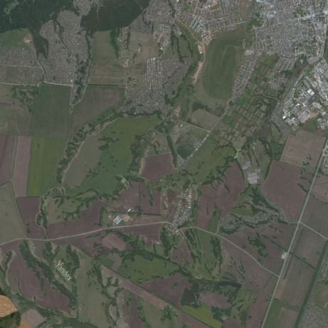

## Задание

## Используемая часть карты
### Приблизительные координаты
### lat = 54.7037 lon = 83.01029

### Преобразование координат в lat, lon (при условии что карта расположена на сфере)

lat = asin(z / R) 
lon = atan2(y, x)

### Обратные преобразования

x = R * cos(lat) * cos(lon) 
y = R * cos(lat) * sin(lon) 
z = R * sin(lat)

